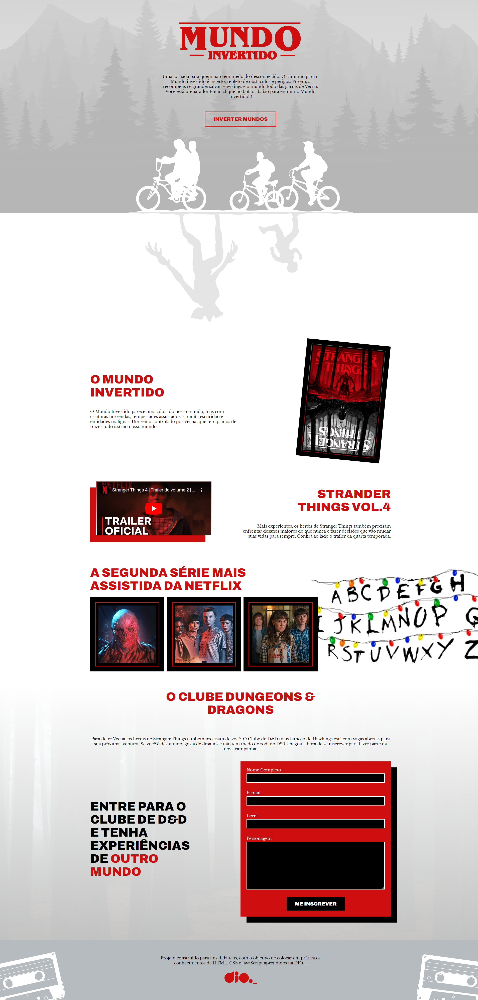
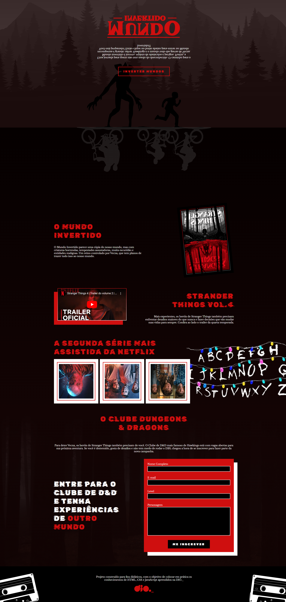
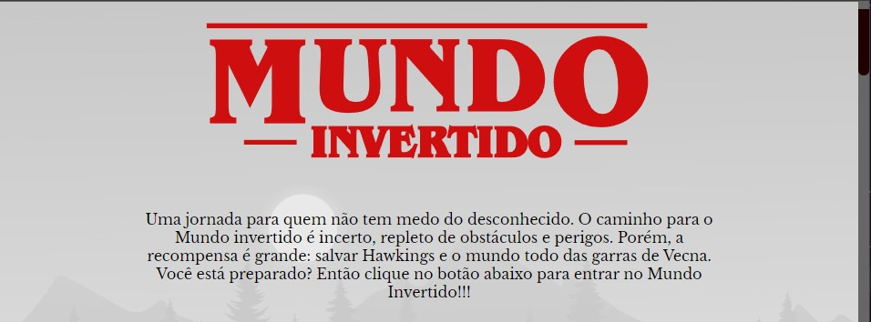

<p align="center" id="topo">  </p>

Construindo um Landing Page com HTML CSS e JS


Endereço surge: <a href="http://mundo-invertido.surge.sh/" target="_blank">**Mundo Invertido**</a>

Endereço gitPage: <a href="https://rickhardbr.github.io/Mundo-Invertido-Dio/" target="_blank">**Mundo Invertido**</a>

  * [Indice](#funciona)
      * <a href="https://github.com/digitalinnovationone/semana-frontend-mundo-invertido" target="new">O Desafio Mundo Invertido.DIO</a>
      * [Aulas](#aulas)
      * [tecnologias](#tecnologias)
      * [Assuntos Abordados](#assuntos)
      * [Links auxiliares](#links)
      * [Extra](#extra)
      * [Imagens](#imagens)


<h2 id="aulas"> ▶️ Semana Front-end</h2>

---


- <a href="https://www.youtube.com/watch?v=FZgIQUDn8zo" target="_blank">Live Dia 01 - HTML - CSS - JS</a>
  
- <a href="https://www.youtube.com/watch?v=WHbhgxJLbN4">Live Dia 02 - JavaScript</a>
  
- <a href="https://www.youtube.com/watch?v=x6oegBgBcG8&t=3517s">Live Dia 03 - Angular x React</a>
  
---

<h2 id="tecnologias"> 💻 Tecnologias</h2>

- HTML
- CSS
- JavaScript
<h2 id="assuntos"> 💬 Assuntos abordados</h2>

- HTML
    - Estruturação da página 
    - Semântica
    - Acessibilidade
    - Web Scraping
    - SEO
- CSS
    - Posicionamentos
    - Pseudo-elementos
    - Pseudo-classes
    - Flexbox
    - Animações 
- JavaScript
    - Introdução ao JavaScript
    - Manipulação do DOM
    - Introdução ao Firebase
    - Integração com o Firebase

---

<h2 id="links">🔗 Links auxiliares</h2>


- <a href="http://w3c.org">W3C - World Wide Web Consortium</a>
- <a href="https://www.w3.org/WAI/">WAI - Web Acessibility Initiative</a>
- <a href="https://www.w3.org/WAI/WCAG21/quickref/">WCAG 2</a>
- <a href="https://www.figma.com/file/I3Q42CcVUziRN3iMfTrbfb/Stranger-Things?node-id=0%3A1">Figma</a>
- <a href="https://micheleambrosio.github.io/semana-frontend-mundo-invertido/">Demo</a>

---
<h1 id="extra">Extra</h1>

> Acrescetei o id="scrollbar" para estilizar a barra de rolagem

```html
<body class="light-theme" aria-label="O site está utilizando o tema light" role="body" id="scrollbar">

```

> e na estilização ficou assim:

```css
body::-webkit-scrollbar {
  width: 12px;
  background-color: rgba(0, 0, 0, 0.6);
  };

body::-webkit-scrollbar-track  {
  background-color: rgba(131, 5, 5, 0.6);
  }

body::-webkit-scrollbar-thumb {
  background-color: rgb(31, 1, 1);
  border-bottom-left-radius: 50px; 
  border-bottom-right-radius: 50px; 
  }

```

> Também criei um favicon para a página


<h1 align="center" id="imagens">Imagens</h1>

<p align="center">

</p>

<p align="center">

</p>
<h4 align="right"><a href="#topo">Topo</a></h4>

<p align="center">

</p>
<h4 align="right"><a href="#topo">Topo</a></h4>

<p align="center">

</p>
<h4 align="right"><a href="#topo">Topo</a></h4>
